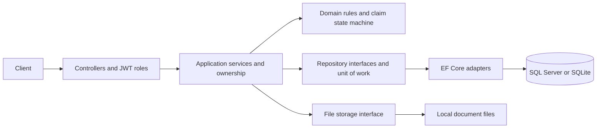

# Actual system design and scaling plan

The alignment branch is based on main commit 928011391451ed5e41ca2cfef4e6269e5f825d25. Implemented behavior and proposed work are distinguished below. No external deployment was performed.

## Actual architecture

One .NET 10 API, five code layers, one relational model, and local document files. Auth, Customers, Policies, Claims and Payouts are feature boundaries within one deployment. This is a layered monolith with room for stronger module boundaries.

Submission authenticates the caller, validates the amount/date/type/description, loads the policy, checks ownership and active coverage, checks committed amounts, creates a claim and initial history, and commits through IUnitOfWork. Retrieval and lists scope claimants to their customer. Cancellation and upload check ownership; adjudication requires staff. Payout processing is bookkeeping, not an external payment.

One SaveChanges is the relational write transaction. Coverage reads preceding it are outside that atomic write. Document bytes are saved before the metadata commit, allowing orphan files after failure. Database history is not an immutable audit system. No queue, cache, external payment provider or browser frontend is implemented.

### Source map and API boundaries

| Area | Source / responsibility |
| --- | --- |
| Composition, JWT and health | API/Program.cs, Extensions/AuthenticationExtensions.cs, Health/DatabaseReadinessCheck.cs |
| Auth | /api/auth; register/login and administrator-controlled staff creation; Application/Features/Auth, Infrastructure/Identity |
| Customers | /api/customers; staff management |
| Policies | /api/policies; staff creation/management and owner-scoped reads; Application/Features/Policies/PolicyService.cs |
| Claims | /api/claims; submission, get/list, review/information/approve/reject/cancel and upload; Application/Features/Claims/ClaimService.cs |
| Domain | Domain/Entities/Claim.cs, Policy.cs, Payout.cs; entities, lifecycle and invariants |
| Payouts | /api/payouts; staff bookkeeping; Application/Features/Payouts/PayoutService.cs |
| Persistence | Infrastructure/Persistence/ClaimsDbContext.cs, ProviderDbContexts.cs, Configurations, Repositories and Migrations |
| File storage | Infrastructure/Storage/LocalFileStorage.cs |
| Tests | tests/Claims.Tests/Integration; real HTTP, authentication and migrated SQLite |
| Demo | infra/main.bicep, .github/workflows/deploy.yml |

Paths above are under src/Claims.* unless stated otherwise. The complete relationships and states are in [ARCHITECTURE.md](ARCHITECTURE.md). Customer ownership is not multi-insurer tenancy; a tenant boundary does not exist yet.

## Implemented alignment

- Preserves the current domain, contracts, roles and unit of work.
- Rejects invalid claim input before persistence, checks decimal precision and trims descriptions.
- Fixes cross-customer cancellation/policy access and rejects unlinked claimant tokens.
- Requires explicit production signing configuration and disables default production seeding.
- Commits separate SQL Server/SQLite migrations and explicit migration/bootstrap mode; serving startup verifies schema.
- Supports chronological SQLite ordering and correct inserts of newly appended aggregate children.
- Adds database readiness and real HTTP integration coverage for persistence, restart, authorization, validation, workflow, payouts and document metadata.
- Aligns framework, dependencies, containers and workflows on .NET 10; verifies tests and migration models before demo deployment.

This proves a functional foundation locally. It does not prove production capacity, live SQL Server behavior, safe adoption of an existing database, financial settlement or compliance.

## Ordered scaling plan

### 1. Durable storage and correctness

Replace demo container-local SQLite with shared SQL Server/Azure SQL. Implement Blob Storage behind IFileStorage; store private document bytes there and metadata in SQL. Container replacement loses local files, and replicas otherwise see different data. Apply migrations once in a release job, then launch replicas. Define backup/retention policies and rehearse restoration before accepting real claims.

Add claim/payout concurrency tokens and conflict responses for stale writes. A token on each claim alone cannot protect aggregate coverage across different claims. Serialize the coverage check/reservation using a policy balance/version row with transactional protection, or an equivalent invariant-preserving design. Prove this with simultaneous approvals whose combined amount exceeds coverage. Also test cancellation versus review and duplicate payout processing.

Add identity/operation-scoped idempotency keys to submit, payout creation and future external payments; persist the normalized request hash and result atomically with the operation. Define key retention and replay, reject key reuse for another payload, and map unique constraint collisions to stable errors. Current coverage counts Approved/Paid claims; add explicit reservations if pending claims should consume coverage.

### 2. Request and database capacity

Once storage is shared, run stateless API replicas behind ingress/load balancing. Set HTTP concurrency and min/max replicas from load tests; bound the combined SQL connection count. A nonzero minimum may be needed for interactive latency. Use readiness to gate traffic and graceful shutdown to finish or cancel safely.

Measure throughput, p50/p95/p99, errors, SQL duration, locks, connection saturation, CPU/memory and uploads. Unit/integration tests establish no requests-per-second capacity. Define SLOs from customer needs; proposed pilot targets could be p95 reads <300 ms, writes <500 ms excluding uploads, and 99.9% availability. These are unmeasured proposals, not promises.

Load-test realistic data sizes, users, staff activity and burst uploads. Increase load until latency/errors fail, diagnose one bottleneck, change it and retest. Include replica loss, scale-out and transient SQL failures.

Inspect query plans before indexing. Candidates include Policy(CustomerId, Id), Claim(PolicyId, SubmittedAtUtc, Id) and staff status/date filters; verify existing indexes and write cost first. Project list DTOs, avoid unused child loads and adopt keyset paging with an ID tie-breaker when deep offset paging becomes slow. Offset paging is implemented today. Retry only safe operations. Keep coverage decisions on the authoritative writer. Move reports to exports/read models when necessary; archive/partition history by retention policy at high volume. Sharding requires explicit tenant boundaries and measured need.

### 3. Durable asynchronous workflows

Add an outbox row in the same SQL transaction as business state. A dispatcher publishes to a broker; workers handle notifications, document scanning/OCR, fraud enrichment and future payment integrations. Delivery is at least once: consumers need deduplication/inbox, bounded retries, dead-letter handling and replay. Do not assume globally exactly-once behavior.

Deploy workers independently and scale by queue depth/age. Represent pending checks and failures explicitly in workflows. For real payouts use provider idempotency, authenticated webhooks, reconciliation and an auditable ledger. A local Paid status does not prove funds settled.

### 4. Security, identity and privacy

Restrict CORS, add login/registration throttling and per-identity quotas, and enforce body/upload limits. Add verification, lockout/recovery, staff MFA, token rotation/revocation and user disablement rules. Choose deliberately between self-issued tokens and a managed OIDC identity provider.

Use managed identity where possible, secret rotation, TLS, least privilege, private dependency access and image/dependency scans. Consider restricting Swagger. Authorize every document download; keep blobs private, issue short-lived access if needed, inspect contents, quarantine/scan uploads and clean orphan files. An upload-size limit is not malware protection.

Define PII minimization, retention, legal holds and access/deletion procedures with business/legal owners. Keep descriptions, document bodies, passwords and tokens out of logs. Protect audit records from ordinary modification/deletion. Add insurer/organization tenancy throughout models, authorization, filters and constraints before serving multiple insurers. Add currency/rounding rules before supporting multiple currencies.

### 5. Reliability and delivery

Add OpenTelemetry traces/metrics and correlation IDs. Dashboards need latency/errors, dependency health, claim age, review backlog, payout age/failures and queue age. Separate business audit from diagnostics. Establish SLO alerts, runbooks and incident ownership.

Define recovery-time and recovery-point objectives; prove database plus document recovery and point-in-time restoration. Choose zone redundancy, regional recovery and data residency from these requirements. Keep one authoritative writer initially; cross-region financial state introduces conflict/reconciliation complexity.

Release immutable images with tests/scans, workload federation, staged environments, smoke checks, safe rollout/rollback and expand/contract migrations. Image rollback does not reverse data. The existing workflow's environment label is production, but its infrastructure is a disposable demo and must be replaced before a production release.

### 6. Cost, product and team scale

Budget and alert on compute, SQL, storage, retention and log ingestion; track cost per claim/document. Scale-to-zero trades latency for idle savings; free grants are not a cost guarantee. Add caching only for measured safe reads, with customer/tenant-scoped keys and invalidation; never treat cached remaining coverage as authoritative.

Version API contracts and insurance rules; document decisions for audit. Add contract tests and module ownership. Keep the layered monolith until independent scaling/releases or isolation outweigh distributed-system costs. Document processing/notifications are plausible first separate deployments. Splitting tightly related policy/claim data early creates avoidable cross-service consistency work.

## Release gates

| Stage | Work | Required evidence |
| --- | --- | --- |
| Alignment | Validation, ownership, migrations, readiness and integration tests | Clean build/tests and both migration models current |
| Production pilot | Shared SQL/Blob, concurrency/idempotency, identity/rate limits, secrets/backups | Live SQL Server tests, concurrency/duplicate tests, storage access/scanning tests, migration rehearsal and restore drill |
| Traffic growth | Replicas, measured queries/indexes, connection budgets and SLOs | Realistic load/soak, faults, scale-out consistency and alerts |
| Workflow growth | Outbox, broker/workers and payment reconciliation | Crash/replay/duplicate handling and backlog recovery |
| Business growth | Tenancy/currency, analytics separation and regional recovery | Isolation tests, audit/retention review and DR exercise |

Local SQLite tests do not exercise live SQL Server, Docker/Bicep deployments, cloud storage, concurrency stress or performance. Existing databases need adoption rehearsal; fresh-schema success is not an upgrade guarantee.

## Primary references

- [EF migrations for multiple providers](https://learn.microsoft.com/en-us/ef/core/managing-schemas/migrations/providers)
- [EF concurrency control](https://learn.microsoft.com/en-us/ef/core/saving/concurrency)
- [Container Apps storage lifetime](https://learn.microsoft.com/en-us/azure/container-apps/storage-mounts)
- [Container Apps scaling](https://learn.microsoft.com/en-us/azure/container-apps/scale-app)
- [Queue-based load leveling](https://learn.microsoft.com/en-us/azure/architecture/patterns/queue-based-load-leveling)

Implementation claims above come from this branch. Cloud recommendations are proposed; capacity and cost were not measured.
